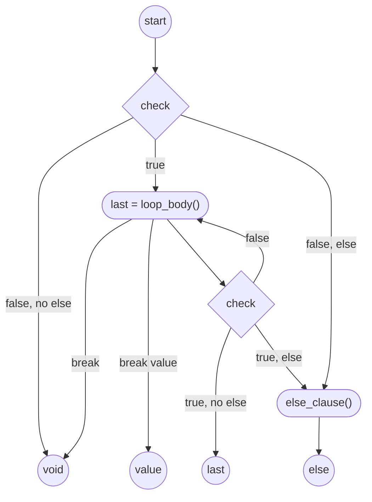

# Lyng tutorial

Lyng is a very simple language, where we take only most important and popular features from
other scripts and languages. In particular, we adopt _principle of minimal confusion_[^1].
In other word, the code usually works as expected when you see it. So, nothing unusual.

__Other documents to read__ maybe after this one:

- [Advanced topics](advanced_topics.md), [declaring arguments](declaring_arguments.md), [Scopes and Closures](scopes_and_closures.md)
- [OOP notes](OOP.md), [exception handling](exceptions_handling.md)
- [math in Lyng](math.md), [the `when` statement](when.md)
- [Testing and Assertions](Testing.md)
- [time](time.md) and [parallelism](parallelism.md)
- [parallelism] - multithreaded code, coroutines, etc.
- Some class
  references: [List], [Set], [Map], [Real], [Range], [Iterable], [Iterator], [time manipulation](time.md), [Array], [RingBuffer], [Buffer].
- Some samples: [combinatorics](samples/combinatorics.lyng.md), national vars and
  loops: [сумма ряда](samples/сумма_ряда.lyng.md). More at [samples folder](samples)

# Expressions

Everything is an expression in Lyng. Even an empty block:

    // empty block
    >>> void

any block also returns it's last expression:

    if( true ) {
        2 + 2
        3 + 3
    }
    >>> 6

If you don't want block to return anything, use `void`:

    fn voidFunction() {
        3 + 4 // this will be ignored
        void
    }
    voidFunction()
    >>> void

otherwise, last expression will be returned:

    fn normalize(value, minValue, maxValue) {
        (value - minValue) / (maxValue-minValue)
    }
    normalize( 4, 0.0, 10.0)
    >>> 0.4

Every construction is an expression that returns something (or `void`):

    val x = 111 // or autotest will fail!
    val limited = if( x > 100 ) 100 else x
    limited
    >>> 100

You can use blocks in if statement, as expected:

    val x = 200
    val limited = if( x > 100 ) {
        100 + x * 0.1    
    }
    else 
        x
    limited
    >>> 120.0

## Enums (quick intro)

Lyng supports simple enums for a fixed set of named constants. Declare with `enum Name { ... }` and use entries as `Name.ENTRY`.

    enum Color {
        RED, GREEN, BLUE
    }

    assert( Color.RED is Color )
    assertEquals( 0, Color.RED.ordinal )
    assertEquals( "BLUE", Color.BLUE.name )

    // All entries as a list, in order:
    assertEquals( [Color.RED, Color.GREEN, Color.BLUE], Color.entries )

    // Lookup by name:
    assertEquals( Color.GREEN, Color.valueOf("GREEN") )

For more details (usage patterns, `when` switching, serialization), see OOP notes: [Enums in detail](OOP.md#enums).

## Singleton Objects

Singleton objects are declared using the `object` keyword. They define a class and create its single instance immediately.

    object Logger {
        fun log(msg) { println("[LOG] " + msg) }
    }
    
    Logger.log("Hello singleton!")

## Delegation (briefly)

You can delegate properties and functions to other objects using the `by` keyword. This is perfect for patterns like `lazy` initialization.

    val expensiveData by lazy {
        // computed only once on demand
        "computed"
    }

For more details on these features, see [Delegation in Lyng](delegation.md) and [OOP notes](OOP.md).

When putting multiple statments in the same line it is convenient and recommended to use `;`:

    var from; var to
    from = 0; to = 100
    >>> 100

Notice: returned value is `100` as assignment operator returns its assigned value.
Most often you can omit `;`, but improves readability and prevent some hardly seen bugs.

## Assignments

Assignemnt is an expression that changes its lvalue and return assigned value:

    var x = 100
    x = 20
    println(5 + (x=6)) // 11: x changes its value!
    x
    >>> 11
    >>> 6

### Destructuring assignments

Lyng supports destructuring assignments for lists. This allows you to unpack list elements into multiple variables at once:

    val [a, b, c] = [1, 2, 3]
    assertEquals(1, a)
    assertEquals(2, b)
    assertEquals(3, c)

It also supports *splats* (ellipsis) to capture multiple elements into a list:

    val [head, rest...] = [1, 2, 3]
    assertEquals(1, head)
    assertEquals([2, 3], rest)

    val [first, middle..., last] = [1, 2, 3, 4, 5]
    assertEquals(1, first)
    assertEquals([2, 3, 4], middle)
    assertEquals(5, last)

Destructuring can be nested:

    val [x, [y, z...]] = [1, [2, 3, 4]]
    assertEquals(1, x)
    assertEquals(2, y)
    assertEquals([3, 4], z)

And it can be used for reassigning existing variables, for example, to swap values:

    var x = 5
    var y = 10
    [x, y] = [y, x]
    assertEquals(10, x)
    assertEquals(5, y)

As the assignment itself is an expression, you can use it in strange ways. Just remember
to use parentheses as assignment operation insofar is left-associated and will not
allow chained assignments (we might fix it later). Use parentheses insofar:

    var x = 0
    var y = 0
    x = (y = 5)
    assert(x==5)
    assert(y==5)
    >>> void

Note that assignment operator returns rvalue, it can't be assigned.

## Modifying arithmetics

There is a set of assigning operations: `+=`, `-=`, `*=`, `/=` and even `%=`.

    var x = 5
    assert( 25 == (x*=5) )
    assert( 25 == x)
    assert( 24 == (x-=1) )
    assert( 12 == (x/=2) )
    x
    >>> 12

Notice the parentheses here: the assignment has low priority!

These operators return rvalue, unmodifiable.

## Assignment return r-value!

Naturally, assignment returns its value:

    var x
    x = 11
    >>> 11

rvalue means you cant assign the result if the assignment

    var x
    assertThrows { (x = 11) = 5 }
    void
    >>> void

This also prevents chain assignments so use parentheses:

    var x
    var y
    x = (y = 1)
    >>> 1

## Nullability

When the value is `null`, it might throws `NullReferenceException`, the name is somewhat a tradition. To avoid it
one can check it against null or use _null coalescing_. The null coalescing means, if the operand (left) is null,
the operation won't be performed and the result will be null. Here is the difference:

    val ref = null
    assertThrows {  ref.field }
    assertThrows {  ref.method() }
    assertThrows {  ref.array[1] }
    assertThrows {  ref[1] }
    assertThrows {  ref() }
    
    assert( ref?.field == null )
    assert( ref?.method() == null )
    assert( ref?.array?[1] == null )
    assert( ref?[1] == null )
    assert( ref?() == null )
    >>> void

There is also "elvis operator", null-coalesce infix operator '?:' that returns rvalue if lvalue is `null`:

    null ?: "nothing"
    >>> "nothing"

## Utility functions

The following functions simplify nullable values processing and
allow to improve code look and readability. There are borrowed from Kotlin:

### let

`value.let {}` passes to the block value as the single parameter (by default it is assigned to `it`) and return block's
returned value. It is useful dealing with null or to
get a snapshot of some externally varying value, or with `?.` to process nullable value in a safe manner:

    // this state is changed from parallel processes
    class GlobalState(nullableParam)
    
    val state = GlobalState(null)

    fun sample() {
        state.nullableParam?.let { "it's not null: "+it} ?: "it's null"
    }
    assertEquals(sample(), "it's null")
    state.nullableParam = 5
    assertEquals(sample(), "it's not null: 5")
    >>> void

This is the same as:

    fun sample() {
        val it = state.nullableParam
        if( it != null )  "it's not null: "+it else "it's null"
    }

The important is that nullableParam got a local copy that can't be changed from any
parallel thread/coroutine. Remember: Lyng _is __not__ a single-threaded language_.

## Also

Much like let, but it does not alter returned value:

    assert( "test".also { println( it + "!") } == "test" )
    >>> test!
    >>> void

While it is not altering return value, the source object could be changed:
also
    class Point(x,y)
    val p = Point(1,2).also { it.x++ }
    assertEquals(p.x, 2)
    >>> void

## apply

It works much like `also`, but is executed in the context of the source object:

    class Point(x,y)
    // see the difference: apply changes this to newly created Point:
    val p = Point(1,2).apply { x++; y++ }
    assertEquals(p, Point(2,3))
    >>> void

## run

Executes a block after it returning the value passed by the block. for example, can be used with elvis operator:

    var someVar = null
    val result = someVar ?: run {
      someVar = 121
      "reset"
    }
    assertEquals("reset", result)
    assertEquals(121, someVar)
    >>> void

## Math

It is rather simple, like everywhere else:

    val x = 2.0
    sin(x * π/4) / 2.0
    >>> 0.5

See [math](math.md) for more on it. Notice using Greek as identifier, all languages are allowed.

Logical operation could be used the same

    var x = 10
    ++x >= 11
    >>> true

## Supported operators

|    op    | ass | args              | comments |
|:--------:|-----|-------------------|----------|
|    +     | +=  | Int or Real       |          |
|    -     | -=  | Int or Real       | infix    |
|    *     | *=  | Int or Real       |          |
|    /     | /=  | Int or Real       |          |
|    %     | %=  | Int or Real       |          |
|    &&    |     | Bool              |          |
|   \|\|   |     | Bool              |          |   
|    !x    |     | Bool              |          |
|    <     |     | String, Int, Real | (1)      |
|    <=    |     | String, Int, Real | (1)      |
|    >=    |     | String, Int, Real | (1)      |
|    >     |     | String, Int, Real | (1)      |
|    ==    |     | Any               | (1)      |
|   ===    |     | Any               | (2)      |
|   !==    |     | Any               | (2)      |
|    !=    |     | Any               | (1)      |
|    =~    |     |                   | (3)      |
|    !~    |     |                   | (3)      |
| ++a, a++ |     | Int               |          |
| --a, a-- |     | Int               |          |

(1)
: comparison are based on comparison operator which can be overloaded

(2)
: referential equality means left and right operands references exactly same instance of some object. Note that all
singleton object, like `null`, are referentially equal too, while string different literals even being equal are most
likely referentially not equal

(3)
: Implemented now in String and Regex as regular expression match and not match, see [Regex].

Reference quality and object equality example:

    assert( null == null)  // singletons
    assert( null === null)
    // but, for non-singletons:
    assert( "foo" !== "foo" )
    >>> void

# Variables

Much like in kotlin, there are _variables_:

    var name = "Sergey"

Variables can be not initialized at declaration, in which case they must be assigned before use, or an exception
will be thrown:

    var foo
    // WRONG! Exception will be thrown at next line:
    foo + "bar"

The correct pattern is:

    foo = "foo"
    // now is OK:
    foo + bar

This is though a rare case when you need uninitialized variables, most often you can use conditional operators
and even loops to assign results (see below).

# Constants

Almost the same, using `val`:

    val foo = 1
    foo += 1 // this will throw exception

# Constants

Same as in kotlin:

    val HalfPi = π / 2

Note using greek characters in identifiers! All letters allowed, but remember who might try to read your script, most
likely will know some English, the rest is the pure uncertainty.

# Defining functions

    fun check(amount) {
        if( amount > 100 )
            "enough"
        else
            "more"
    }
    >>> Callable@...

Notice how function definition return a value, instance of `Callable`.

You can use both `fn` and `fun`. Note that function declaration _is an expression returning callable_,
but Lyng syntax requires using the __lambda syntax__ to create such.

    val check = { 
        it > 0 && it < 100
    }
    assert( check(1) )
    assert( !check(101) )
    >>> void

See lambdas section below.

## Declaring arguments

There are default parameters in Lyng:

    fn check(amount, prefix = "answer: ") {
        prefix + if( amount > 100 )
            "enough"
        else
            "more" 
    }
    assert( "do: more" == check(10, "do: ") )
    check(120)
    >>> "answer: enough"

It is possible to define also vararg using ellipsis:

    fun sum(args...) {
        var result = args[0]
        for( i in 1 ..< args.size ) result += args[i]
    }
    sum(10,20,30)
    >>> 60

See the [arguments reference](declaring_arguments.md) for more details.

## Named arguments

When calling functions, you can use named arguments with the colon syntax `name: value`. This is particularly useful when you have many parameters with default values.

```lyng
    fun test(a="foo", b="bar", c="bazz") { [a, b, c] }

    assertEquals(["foo", "b", "bazz"], test(b: "b"))
    assertEquals(["a", "bar", "c"], test("a", c: "c"))
```

**Note for Kotlin users:** Lyng uses `:` instead of `=` for named arguments at call sites. This is because in Lyng, `=` is an expression that returns the assigned value, and using it in an argument list would create ambiguity.

## Closures

Each __block has an isolated context that can be accessed from closures__. For example:

    var counter = 1

    // this is ok: counter is incremented
    fun increment(amount=1) {
        // use counter from a closure:
        counter = counter + amount
    }

    increment(10)
    assert( counter == 11 )

    val callable = {
        // this obscures global outer var with a local one
        var counter = 0
        // ...
        counter = 1
        // ...
        counter
    }

    assert(callable() == 1)
    // but the global counter is not changed:
    assert(counter == 11)
    >>> void

## Lambda functions

Lambda expression is a block with optional argument list ending with `->`. If argument list is omitted,
the call arguments will be assigned to `it`:

    lambda = {
        it + "!"
    }
    assert( lambda is Callable)
    assert( lambda("hello") == "hello!" )
    void

### `it` assignment rules

When lambda is called with:

- no arguments: `it == void`
- exactly one argument: `it` will be assigned to it
- more than 1 argument: `it` will be a `List` with these arguments:

Here is an example:

    val lambda = { it }
    assert( lambda() == void )
    assert( lambda("one") == "one")
    assert( lambda("one", "two") == ["one", "two"])
    >>> void

If you need to create _unnamed_ function, use alternative syntax (TBD, like { -> } ?)

### Declaring parameters

Parameter is a list of comma-separated names, with optional default value; last
one could be with ellipsis that means "the rest pf arguments as List":

    assert( { a -> a }(10) == 10 )
    assert( { a, b -> [a,b] }(1,2) == [1,2])
    assert( { a, b=-1 -> [a,b] }(1) == [1,-1])
    assert( { a, b...-> [a,...b] }(100) == [100]) 
    // notice that splat syntax in array literal unrills
    // ellipsis-caught arguments back:
    assert( { a, b...-> [a,...b] }(100, 1, 2, 3) == [100, 1, 2, 3]) 
    void

### Using lambda as the parameter

See also: [Testing and Assertions](Testing.md)

    // note that fun returns its last calculated value,
    // in our case, result after in-place addition:
    fun mapValues(iterable, transform) {
        var result = []
        for( x in iterable ) result += transform(x)
    }
    assert( [11, 21, 31] == mapValues( [1,2,3], { it*10+1 }))
    >>> void

### Auto last parameter

When the function call is follower by the `{` in the same line, e.g. lambda immediately
after function call, it is treated as a last argument to the call, e.g.:

    fun mapValues(iterable, transform) {
        var result = []
        for( x in iterable ) result += transform(x)
    }
    val mapped = mapValues( [1,2,3]) { 
        it*10+1 
    }
    assert( [11, 21, 31] == mapped)
    >>> void

# Lists (aka arrays)

Lyng has built-in mutable array class `List` with simple literals:

    [1, "two", 3.33].size
    >>> 3

[List] is an implementation of the type `Array`, and through it `Collection` and [Iterable]. Please read [Iterable],
many collection based methods are implemented there.

Lists can contain any type of objects, lists too:

    val list = [1, [2, 3], 4]
    assert( list is List )      // concrete implementatino
    assert( list is Array )     // general interface
    assert(list.size == 3)
    // second element is a list too:
    assert(list[1].size == 2)
    >>> void

Notice usage of indexing. You can use negative indexes to offset from the end of the list; see more in [Lists](List.md).

When you want to "flatten" it to single array, you can use splat syntax:

    [1, ...[2,3], 4]
    >>> [1,2,3,4]

Of course, you can splat from anything that is List (or list-like, but it will be defined later):

    val a = ["one", "two"]
    val b = [10.1, 20.2]
    ["start", ...b, ...a, "end"]
    >>> [start,10.1,20.2,one,two,end]

Of course, you can set any list element:

    val a = [1, 2, 3]
    a[1] = 200
    a
    >>> [1,200,3]

Lists are comparable, and it works well as long as their respective elements are:

    assert( [1,2,3] == [1,2,3])
    
    // but they are _different_ objects:
    assert( [1,2,3] !== [1,2,3])
    
    // when sizes are different, but common part is equal,
    // longer is greater
    assert( [1,2,3] > [1,2] )

    // otherwise, where the common part is greater, the list is greater:
    assert( [1,2,3] < [1,3] )
    >>> void

The simplest way to concatenate lists is using `+` and `+=`:

    // + works to concatenate iterables: 
    assert( [5, 4] + ["foo", 2] == [5, 4, "foo", 2])
    var list = [1, 2]
    
    // append allow adding iterables: all elements of it:
    list += [2, 1]      
    // or you can append a single element:
    list += "end"
    assertEquals( list, [1, 2, 2, 1, "end"])
    void
    >>> void

***Important note***: the pitfall of using `+=` is that you can't append in [Iterable] instance as an object: it will
always add all its contents. Use `list.add` to add a single iterable instance:

    var list = [1, 2]
    val other = [3, 4]

    // appending lists is clear:
    list += other
    assert( list == [1, 2, 3, 4] )
    
    // but appending other Iterables could be confusing:
    list += (10..12)
    assert( list == [1, 2, 3, 4, 10, 11, 12])
    >>> void

Use `list.add` to avoid confusion:

    var list = [1, 2]
    val other = [3, 4]

    // appending lists is clear:
    list.add(other)
    assert( list == [1, 2, [3, 4]] )
    
    // but appending other Iterables could be confusing:
    list.add(10..12)
    assert( list == [1, 2, [3, 4], (10..12)])
    >>> void

To add elements to the list:

    val x = [1,2]
    x.add(3)
    assert( x == [1,2,3])
    // same as x += ["the", "end"] but faster:
    x.add("the", "end")
    assert( x == [1, 2, 3, "the", "end"])
    >>> void

Self-modifying concatenation by `+=` also works (also with single elements):

    val x = [1, 2]
    x += [3, 4]
    x += 5
    assert( x == [1, 2, 3, 4, 5])
    >>> void

You can insert elements at any position using `insertAt`:

    val x = [1,2,3]
    x.insertAt(1, "foo", "bar")
    assert( x == [1, "foo", "bar", 2, 3])
    >>> void

Using splat arguments can simplify inserting list in list:

    val x = [1, 2, 3]
    x.insertAt( 1, ...[0,100,0])
    x
    >>> [1,0,100,0,2,3]

Note that to add to the end you still need to use `add` or positive index of the after-last element:

    val x = [1,2,3]
    x.insertAt(3, 10)
    x
    >>> [1,2,3,10]

but it is much simpler, and we recommend to use '+='

    val x = [1,2,3]
    x += 10
    >>> [1,2,3,10]

## Removing list items

    val x = [1, 2, 3, 4, 5]
    x.removeAt(2)
    assert( x == [1, 2, 4, 5])
    // or remove range (start inclusive, end exclusive):
    x.removeRange(1..2)    
    assert( x == [1, 5])
    >>> void

There is a shortcut to remove the last elements:

    val x = [1, 2, 3, 4, 5]

    // remove last:
    x.removeLast()
    assert( x == [1, 2, 3, 4])
    
    // remove 2 last:
    x.removeLast(2)
    assertEquals( [1, 2], x)
    >>> void

You can get ranges to extract a portion from a list:

    val list = [1, 2, 3, 4, 5]
    assertEquals( [1,2,3], list[..2])
    assertEquals( [1,2,], list[..<2])
    assertEquals( [4,5], list[3..])
    assertEquals( [2,3], list[1..2])
    assertEquals( [2,3], list[1..<3])
    >>> void

# Buffers

[Buffer] is a special implementation of an [Array] of unsigned bytes, in the
[separate file](Buffer.md).

# Sets

Set are unordered collection of unique elements, see [Set]. Sets are [Iterable] but have no indexing access.

    assertEquals( Set(3, 2, 1), Set( 1, 2, 3))
    assert( 5 !in Set(1, 2, 6) )
    >>> void

Please see [Set] for detailed description.

# Maps

Maps are unordered collections of key-value pairs, where keys are unique. Maps are also [Iterable].

You can create them either with the classic constructor (still supported):

    val old = Map( "foo" => 77, "bar" => "buzz" )
    assertEquals( old["foo"], 77 )
    >>> void

…or with map literals, which are often more convenient:

    val x = 10
    val y = 10
    val m = { "a": 1, x: x * 2, y: }
    // identifier keys become strings; `y:` is shorthand for y: y
    assertEquals(1, m["a"])      // string-literal key
    assertEquals(20, m["x"])     // identifier key
    assertEquals(10, m["y"])     // shorthand
    >>> void

Map literals support trailing commas for nicer diffs:

    val m2 = {
        "a": 1,
        b: 2,
    }
    assertEquals(1, m2["a"]) 
    assertEquals(2, m2["b"]) 
    >>> void

You can spread other maps inside a literal with `...`. Items merge left-to-right and the rightmost value wins:

    val base = { a: 1, b: 2 }
    val merged = { a: 0, ...base, b: 3, c: 4 }
    assertEquals(1, merged["a"])  // base overwrites a:0
    assertEquals(3, merged["b"])  // literal overwrites spread
    assertEquals(4, merged["c"])  // new key
    >>> void

Merging also works with `+` and `+=`, and you can combine maps and entries conveniently:

    val m3 = { "a": 10 } + ("b" => 20)
    assertEquals(10, m3["a"]) 
    assertEquals(20, m3["b"]) 

    var m4 = ("x" => 1) + ("y" => 2)      // entry + entry → Map
    m4 += { z: 3 }                          // merge literal
    assertEquals(1, m4["x"]) 
    assertEquals(2, m4["y"]) 
    assertEquals(3, m4["z"]) 
    >>> void

Notes:
- Access keys with brackets: `m["key"]`. There is no `m.key` sugar.
- Empty `{}` remains a block/lambda; use `Map()` to create an empty map.
- When you need computed (expression) keys or non-string keys, use `Map(...)` constructor with entries, e.g. `Map( ("a" + "b") => 1 )`, then merge with a literal if needed: `{ base: } + (computedKey => 42)`.

Please see the [Map] reference for a deeper guide.

# Flow control operators

## if-then-else

As everywhere else, and as expression:

    val count = 11
    if( count > 10 )
        println("too much")
    else {
        // do something else
        println("just "+count)
    }
    >>> too much
    >>> void

Notice returned value `void`: it is because of `println` have no return value, e.g., `void`.

Or, more neat:

    var count = 3
    println( if( count > 10 ) "too much" else "just " + count )
    >>> just 3
    >>> void

## When

See also: [Comprehensive guide to `when`](when.md)

It is very much like the kotlin's:

    fun type(x) {
        when(x) {
            in 'a'..'z', in 'A'..'Z' -> "letter"
            in '0'..'9' -> "digit"
            '$' -> "dollar"
            "EUR" -> "crap"
            in ['@', '#', '^'] -> "punctuation1"
            in "*&.," -> "punctuation2"
            else -> "unknown"
        }
    }
    assertEquals("digit", type('3'))
    assertEquals("dollar", type('$'))
    assertEquals("crap", type("EUR"))
    >>> void

Notice, several conditions can be grouped with a comma.
Also, you can check the type too:

    fun type(x) {
        when(x) {
            "42", 42 -> "answer to the great question"
            is Real, is Int -> "number"
            is String -> {
                for( d in x ) {
                    if( d !in '0'..'9' ) 
                        break "unknown"
                }
                else "number"
            }
        }
    }
    assertEquals("number", type(5))
    assertEquals("number", type("153"))
    assertEquals("number", type(π/2))
    assertEquals("unknown", type("12%"))
    assertEquals("answer to the great question", type(42))
    assertEquals("answer to the great question", type("42"))
    >>> void

### supported when conditions:

#### Contains:

You can thest that _when expression_ is _contained_, or not contained, in some object using `in container` and
`!in container`. The container is any object that provides `contains` method, otherwise the runtime exception will be
thrown.

Typical builtin types that are containers (e.g. support `contains`):

| class        | notes                                          |
|--------------|------------------------------------------------|
| [Collection] | contains an element (1)                        |
| Array        | faster maybe that Collection's                 |
| List         | faster than Array's                            |
| String       | character in string or substring in string (3) |
| Range        | object is included in the range (2)            |
| Buffer       | byte is in buffer                              |
| RingBuffer   | object is in buffer                            |

(1)
: Iterable is not the container as it can be infinite

(2)
: Depending on the inclusivity and open/closed range parameters. BE careful here: String range is allowed, but it is
usually not what you expect of it:

    assert( "more" in "a".."z") // string range ok
    assert( 'x' !in "a".."z") // char in string range: probably error
    assert( 'x' in 'a'..'z') // character range: ok
    assert( "x" !in 'a'..'z') // string in character range: could be error
    >>> void

(3)
: `String` also can provide array of characters directly with `str.characters()`, which is [Iterable] and [Array].
String itself is not iterable as otherwise it will interfere when adding strigns to lists (it will add _characters_ it
it would be iterable).

So we recommend not to mix characters and string ranges; use `ch in str` that works
as expected:

    "foo" in "foobar"
    >>> true

and also character inclusion:

    'o' in "foobar"
    >>> true

## while

Regular pre-condition while loop, as expression, loop returns the last expression as everything else:

    var count = 0
    val result = while( count < 5 ) count++
    result
    >>> 4

Notice it _is 4 because when count became 5, the loop body was not executed!_.

We can break while as usual:

    var count = 0
    while( count < 5 ) {
        if( count < 5 ) break
        count = ++count * 10
    }
    >>> void

Why `void`? Because `break` drops out without the chute, not providing anything to return. Indeed, we should provide
exit value in the case:

    var count = 0
    while( count < 50 ) {
        if( count > 3 ) break "too much"
        count = ++count * 10
        "wrong "+count
    }
    >>> "too much"

### Breaking nested loops

If you have several loops and want to exit not the inner one, use labels:

    var count = 0
    // notice the label:
    outerLoop@ while( count < 5 ) {
        var innerCount = 0
        while( innerCount < 100 ) {
            innerCount = innerCount + 1

            if( innerCount == 5 && count == 2 )
                // and here we break the labelled loop:
                break@outerLoop "5/2 situation"
        }
        count = count + 1
        count * 10
    }
    >>> "5/2 situation"

### and continue

We can skip the rest of the loop and restart it, as usual, with `continue` operator.

    var count = 0
    var countEven = 0
    while( count < 10 ) {
        count = count + 1
        if( count % 2 == 1) continue
        countEven = countEven + 1
    }
    "found even numbers: " + countEven
    >>> "found even numbers: 5"

`continue` can't "return" anything: it just restarts the loop. It can use labeled loops to restart outer ones (we
intentionally avoid using for loops here):

    var count = 0
    var total = 0
    // notice the label:
    outerLoop@ while( count++ < 5 ) {
        var innerCount = 0
        while( innerCount < 10 ) {
            if( ++innerCount == 10 )
                continue@outerLoop
        }
        // we don't reach it because continue above restarts our loop
        total = total + 1
    }
    total
    >>> 0

Notice that `total` remains 0 as the end of the outerLoop@ is not reachable: `continue` is always called and always make
Lyng to skip it.

## else statement

The while and for loops can be followed by the else block, which is executed when the loop
ends normally, without breaks. It allows override loop result value, for example,
to not calculate it in every iteration. For example, consider this naive prime number
test function (remember function return it's last expression result):

    fun naive_is_prime(candidate) {
        val x = if( candidate !is Int) candidate.toInt() else candidate
        var divisor = 1
        while( ++divisor < x/2 || divisor == 2 ) {
            if( x % divisor == 0 ) break false
        }
        else true
    }
    assert( !naive_is_prime(16) )
    assert( naive_is_prime(17) )
    assert( naive_is_prime(3) )
    assert( !naive_is_prime(4) )
    >>> void

## Loop return value diagram



So the returned value, as seen from diagram could be one of:

- `void`, if the loop was not executed, e.g. `condition` was initially false, and there was no `else` clause, or if the
  empty break was executed.
- value returned from `break value' statement
- value returned from the `else` clause, of the loop was not broken
- value returned from the last execution of loop body, if there was no `break` and no `else` clause.

## do-while loops

There works exactly as while loops but the body is executed prior to checking the while condition:

    var i = 0
    do { i++ } while( i < 1 )
    i
    >>> 1

The important feature of the do-while loop is that the condition expression is
evaluated on the body scope, e.g., variables, intruduced in the loop body are
available in the condition:

    do {
        var continueLoop = false
        "OK"
    } while( continueLoop )
    >>> "OK"

This is sometimes convenient when condition is complex and has to be calculated inside the loop body. Notice the value
returning by the loop:

    fun readLine() { "done: result" }
    val result = do {
        val line = readLine()
    } while( !line.startsWith("done:") )
    result.drop(6)
    >>> "result"

Suppose readLine() here reads some stream of lines.

## For loops

For loop are intended to traverse collections, and all other objects that supports
size and index access, like lists:

    var letters = 0
    for( w in ["hello", "wolrd"]) {
        letters += w.length
    }
    "total letters: "+letters
    >>> "total letters: 10"

For loop support breaks the same as while loops above:

    fun search(haystack, needle) {    
        for(ch in haystack) {
            if( ch == needle) 
                break "found"
        }
        else null
    }
    assert( search("hello", 'l') == "found")
    assert( search("hello", 'z') == null)
    >>> void

We can use labels too:

    fun search(haystacks, needle) {    
        exit@ for( hs in haystacks ) {
                for(ch in hs ) {
                    if( ch == needle) 
                        break@exit "found"
                }
            }
            else null
    }
    assert( search(["hello", "world"], 'l') == "found")
    assert( search(["hello", "world"], 'z') == null)
    >>> void

# Exception handling

Very much like in Kotlin. Try block returns its body block result, if no exception was cauht, or the result from the
catch block that caught the exception:

    var error = "not caught"
    var finallyCaught = false
    val result = try {
        throw IllegalArgumentException()
        "invalid"
    }
    catch(nd: SymbolNotDefinedException) {
        error = "bad catch"
    }
    catch(x: IllegalArgumentException) {
        error = "no error"
        "OK"
    }
    finally {
        // finally does not affect returned value
        "too bad"
    }
    assertEquals( "no error", error)
    assertEquals( "OK", result)
    >>> void

There is shorter form of catch block when you want to catch any exception:

    var caught = null
    try {
        throw IllegalArgumentException()
    }
    catch(t) { // same as catch(t: Exception), but simpler
        caught = t
    }
    assert( caught is IllegalArgumentException )
    >>> void

And even shortest, for the Lying lang tradition, missing var is `it`:

    var caught = null
    try {
        throw IllegalArgumentException()
    }
    catch { // same as catch(it: Exception), but simpler
        caught = it
    }
    assert( caught is IllegalArgumentException )
    >>> void

It is possible to catch several exceptions in the same block too, use
`catch( varName: ExceptionClass1, ExceptionClass2)`, etc, use short form of throw and
many more.

- see [exception handling](exceptions_handling.md) for detailed exceptions tutorial and reference.

# Self-assignments in expression

There are auto-increments and auto-decrements:

    var counter = 0
    assert(counter++ * 100 == 0)
    assert(counter == 1)
    >>> void

but:

    var counter = 0
    assert( ++counter * 100 == 100)
    assert(counter == 1)
    >>> void

The same with `--`:

    var count = 100
    var sum = 0
    while( count > 0 ) sum = sum + count--
    sum
    >>> 5050

There are self-assigning version for operators too:

    var count = 100
    var sum = 0
    while( count > 0 ) sum += count--
    sum
    >>> 5050

# Ranges

Ranges are convenient to represent the interval between two values:

    5 in (0..100)
    >>> true

It could be open and closed:

    assert( 5 in (1..5) )
    assert( 5 !in (1..<5) )
    >>> void

Ranges could be inside other ranges:

    assert( (2..3) in (1..10) )
    >>> void

There are character ranges too:

    'd' in 'a'..'e'
    >>> true

and you can use ranges in for-loops:

    for( x in 'a' ..< 'c' ) println(x)
    >>> a
    >>> b
    >>> void

See [Ranges](Range.md) for detailed documentation on it.

# Time routines

These should be imported from [lyng.time](time.md). For example:

    import lyng.time

    val now = Instant()
    val hourAgo = now - 1.hour

See [more docs on time manipulation](time.md)

# Enums

For the moment, only simple enums are implemented. Enum is a list of constants, represented also by their
_ordinal_ - [Int] value.

    enum Color {
        RED, GREEN, BLUE
    }
    
    assert( Color.RED is Color )

    assertEquals( 2, Color.BLUE.ordinal )
    assertEquals( "BLUE", Color.BLUE.name )
    
    assertEquals( [Color.RED,Color.GREEN,Color.BLUE], Color.entries)
    assertEquals( Color.valueOf("GREEN"), Color.GREEN )
    >>> void

Enums are serialized as ordinals. Please note that due to caching, serialized string arrays could be even more compact
than enum arrays, until `Lynon.encodeTyped` will be implemented.

# Comments

    // single line comment
    var result = null // here we will store the result
    >>> null

# Integral data types

| type   | description                     | literal samples     |
|--------|---------------------------------|---------------------|
| Int    | 64 bit signed                   | `1` `-22` `0x1FF`   |
| Real   | 64 bit double                   | `1.0`, `2e-11`      |
| Bool   | boolean                         | `true` `false`      |
| Char   | single unicode character        | `'S'`, `'\n'`       |
| String | unicode string, no limits       | "hello" (see below) |
| List   | mutable list                    | [1, "two", 3]       |
| Void   | no value could exist, singleton | void                |
| Null   | missing value, singleton        | null                |
| Fn     | callable type                   |                     |

See also [math operations](math.md)

## Character details

The type for the character objects is `Char`.

### String literal escapes

| escape | ASCII value           |
|--------|-----------------------|
| \n     | 0x10, newline         |
| \r     | 0x13, carriage return |
| \t     | 0x07, tabulation      |
| \\     | \ slash character     |
| \"     | " double quote        |

Other `\c` combinations, where c is any char except mentioned above, are left intact, e.g.:

    val s = "\a"
    assert(s[0] == '\')
    assert(s[1] == 'a')
    >>> void

same as:

    val s = "\\a"
    assert(s[0] == '\')
    assert(s[1] == 'a')
    >>> void

### Char literal escapes

Are the same as in string literals with little difference:

| escape | ASCII value           |
|--------|-----------------------|
| \n     | 0x10, newline         |
| \r     | 0x13, carriage return |
| \t     | 0x07, tabulation      |
| \\     | \ slash character     |
| \'     | ' apostrophe          |

### Char instance members

    assert( 'a'.code == 0x61 ) 
    >>> void

| member | type | meaning                        |
|--------|------|--------------------------------|
| code   | Int  | Unicode code for the character |
|        |      |                                |

## String details

Strings are arrays of Unicode characters. It can be indexed, and indexing will
return a valid Unicode character at position. No utf hassle:

    "Парашют"[5]
    >>> 'ю'

Its length is, of course, in characters:

    "разум".length
    >>> 5

And supports growing set of kotlin-borrowed operations, see below, for example:

    assertEquals("Hell", "Hello".dropLast(1))
    >>> void

To format a string use sprintf-style modifiers like:

    val a = "hello"
    val b = 11
    assertEquals( "hello:11", "%s:%d"(a, b) )
    assertEquals( " hello:    11", "%6s:%6d"(a, b) )
    assertEquals( "hello :11    ", "%-6s:%-6d"(a, b) )
    >>> void

List of format specifiers closely resembles C sprintf() one.
See [format specifiers](https://github.com/sergeych/mp_stools?tab=readme-ov-file#sprintf-syntax-summary), this is doe
using [mp_stools kotlin multiplatform library](https://github.com/sergeych/mp_stools). Currently supported Lyng types
are `String`, `Int`, `Real`, `Bool`, the rest are displayed using their `toString()` representation.

This list will be extended.

To get the substring use:

    assertEquals("pult", "catapult".takeLast(4))
    assertEquals("cat", "catapult".take(3))
    assertEquals("cat", "catapult".dropLast(5))
    assertEquals("pult", "catapult".drop(4))
    >>> void

And to get a portion you can slice it with range as the index:

    assertEquals( "tap", "catapult"[ 2 .. 4 ])
    assertEquals( "tap", "catapult"[ 2 ..< 5 ])
    >>> void

Open-ended ranges could be used to get start and end too:

    assertEquals( "cat", "catapult"[ ..< 3 ])
    assertEquals( "cat", "catapult"[ .. 2 ])
    assertEquals( "pult", "catapult"[ 4.. ])
    >>> void

### String operations

Concatenation is a `+`: `"hello " + name` works as expected. No confusion. There is also
[Regex] support for strings, see the link, for example, whole string match:

    assert( !"123".matches( "\d\d".re ) )
    assert( "123".matches( "\d\d\d".re ) )
    >>> void

Extraction:

    "abcd42def"[ "\d+".re ].value
    >>> "42"

Part match:

    assert( "abc foo def" =~ "f[oO]+".re )
    assert( "foo" == $~.value )
    >>> void

Typical set of String functions includes:

| fun/prop             | description / notes                                        |
|----------------------|------------------------------------------------------------|
| lower(), lowercase() | change case to unicode upper                               |
| upper(), uppercase() | change case to unicode lower                               |
| trim()               | trim space chars from both ends                            |
| startsWith(prefix)   | true if starts with a prefix                               |
| endsWith(prefix)     | true if ends with a prefix                                 |
| last()               | get last character of a string or throw                    |
| take(n)              | get a new string from up to n first characters             |
| takeLast(n)          | get a new string from up to n last characters              |
| drop(n)              | get a new string dropping n first chars, or empty string   |
| dropLast(n)          | get a new string dropping n last chars, or empty string    |
| size                 | size in characters like `length` because String is [Array] |
| (args...)            | sprintf-like formatting, see [string formatting]           |
| [index]              | character at index                                         | 
| [Range]              | substring at range (2)                                     |
| [Regex]              | find first match of regex, like [Regex.find] (2)           |
| s1 + s2              | concatenation                                              |
| s1 += s2             | self-modifying concatenation                               |
| toReal()             | attempts to parse string as a Real value                   |
| toInt()              | parse string to Int value                                  |
| characters()         | create [List] of characters (1)                            |
| encodeUtf8()         | returns [Buffer] with characters encoded to utf8           |
| matches(re)          | matches the regular expression (2)                         |
|                      |                                                            |

(1)
: List is mutable therefore a new copy is created on each call.

(2)
: See [Regex]

### Literals

String literal could be multiline:

    "Hello
    World"

In this case, it will be passed literally ot "hello\n World". But, if there are
several lines with common left indent, it will be removed, also, forst and last lines,
if blank, will be removed too, for example:

    println("
            This is a multiline text.
            This is a second line.
        ")
    >>> This is a multiline text.
    >>> This is a second line.
    >>> void

- as expected, empty lines and common indent were removed. It is much like kotlin's `""" ... """.trimIndent()`
  technique, but simpler ;)

# Built-in functions

See [math functions](math.md). Other general purpose functions are:

| name                                  | description                                                |
|---------------------------------------|------------------------------------------------------------|
| assert(condition, fn)                 | (1) runtime code check with generic or custom nessage `fn` |
| assertEquals(a,b)                     |                                                            |
| assertNotEquals(a,b)                  |                                                            |
| assertTrows { /* block */ }           |                                                            |
| check(condition, message=<default>)   | throws IllegalStateException" of condition isn't met       |
| require(condition, message=<default>) | throws IllegalArgumentException" of condition isn't met    |
| println(args...)                      | Open for overriding, it prints to stdout with newline.     |
| print(args...)                        | Open for overriding, it prints to stdout without newline.  |
| flow {}                               | create flow sequence, see [parallelism]                    |
| delay, launch, yield                  | see [parallelism]                                          |
| cached(builder)                       | [Lazy evaluation with `cached`](#lazy-evaluation-with-cached) |
| let, also, apply, run                 | see above, flow controls                                   |

(1)
: `fn` is optional lambda returning string message to add to exception string. 
Lambda avoid unnecessary execution if assertion is not failed. for example:

    assert( x < 10 ) { "x=%s should be < 10"(x) } 

# Built-in constants

| name                                | description                  |
|-------------------------------------|------------------------------|
| Real, Int, List, String, List, Bool | Class types for real numbers |
| π                                   | See [math](math.md)          |

[List]: List.md

[Testing]: Testing.md

[Iterable]: Iterable.md

[Iterator]: Iterator.md

[Real]: Real.md

[Range]: Range.md

[String]: development/String.md

[string formatting]: https://github.com/sergeych/mp_stools?tab=readme-ov-file#sprintf-syntax-summary

[Set]: Set.md

[Map]: Map.md

[Buffer]: Buffer.md

[parallelism]: parallelism.md

[RingBuffer]: RingBuffer.md

[Collection]: Collection.md

[Array]: Array.md

[Regex]: Regex.md

## Lazy evaluation with `cached`

Sometimes you have an expensive computation that you only want to perform if and when it is actually needed, and then remember (cache) the result for all future calls. Lyng provides the `cached(builder)` function for this purpose.

It is extremely simple to use: you pass it a block (lambda) that performs the computation, and it returns a zero-argument function that manages the caching for you.

### Basic Example

```lyng
val expensive = cached {
    println("Performing expensive calculation...")
    2 + 2
}

println(expensive()) // Prints "Performing expensive calculation...") then "4"
println(expensive()) // Prints only "4" (result is cached)
```

### Benefits and Simplicity

1.  **Lazy Execution:** The code inside the `cached` block doesn't run until you actually call the resulting function.
2.  **Automatic State Management:** You don't need to manually check if a value has been computed or store it in a separate variable.
3.  **Closures and Class Support:** `cached` works perfectly with closures. If you use it inside a class, it will correctly capture the instance variables, and each instance will have its own independent cache.

### Use Case: Lazy Properties in Classes

This is the most common use case for `cached`. It allows you to define expensive "fields" that are only computed if someone actually uses them:

```lyng
class User(val id: Int) {
    // The details will be fetched only once, on demand
    val details = cached {
        println("Fetching details for user " + id)
        // Db.query is a hypothetical example
        Db.query("SELECT * FROM users WHERE id = " + id)
    }
}

val u = User(101)
// ... nothing happens yet ...
val d = u.details() // Computation happens here
val sameD = u.details() // Returns the same result immediately
```

## Multiple Inheritance (quick start)

Lyng supports multiple inheritance (MI) with simple, predictable rules. For a full reference see OOP notes, this is a quick, copy‑paste friendly overview.

Declare a class with multiple bases and pass constructor arguments to each base in the header:

```
class Foo(val a) {
    var tag = "F"
    fun runA() { "ResultA:" + a }
    fun common() { "CommonA" }
    private fun privateInFoo() {}
    protected fun protectedInFoo() {}
}

class Bar(val b) {
    var tag = "B"
    fun runB() { "ResultB:" + b }
    fun common() { "CommonB" }
}

class FooBar(a, b) : Foo(a), Bar(b) {
    // Inside class bodies you can qualify with this@Type
    fun fromFoo() { this@Foo.common() }
    fun fromBar() { this@Bar.common() }
}

val fb = FooBar(1, 2)
assertEquals("ResultA:1", fb.runA())
assertEquals("ResultB:2", fb.runB())

// Unqualified ambiguous member uses the first base (leftmost)
assertEquals("CommonA", fb.common())

// Disambiguate with casts
assertEquals("CommonB", (fb as Bar).common())
assertEquals("CommonA", (fb as Foo).common())

// Field collisions: unqualified read/write uses the first in order
assertEquals("F", fb.tag)
fb.tag = "X"
assertEquals("X", fb.tag)          // Foo.tag updated
assertEquals("X", (fb as Foo).tag) // qualified read: Foo.tag
assertEquals("B", (fb as Bar).tag) // qualified read: Bar.tag

// Qualified write targets the chosen base storage
(fb as Bar).tag = "Y"
assertEquals("X", (fb as Foo).tag)
assertEquals("Y", (fb as Bar).tag)

// Optional casts with safe call
class Buzz : Bar(3)
val buzz = Buzz()
assertEquals("ResultB:3", buzz.runB())
assertEquals("ResultB:3", (buzz as? Bar)?.runB())
assertEquals(null, (buzz as? Foo)?.runA())
```

Notes:
- Resolution order uses C3 MRO (active): deterministic, monotonic order suitable for diamonds and complex hierarchies. Example: for `class D() : B(), C()` where both `B()` and `C()` derive from `A()`, the C3 order is `D → B → C → A`. The first visible match wins.
- `private` is visible only inside the declaring class; `protected` is visible from the declaring class and any of its transitive subclasses. Qualialsofication (`this@Type`) or casts do not bypass visibility.
- Safe‑call `?.` works with `as?` for optional dispatch.

## Extension members

You can add new methods and properties to existing classes without modifying them.

### Extension functions

    fun String.shout() = this.upper() + "!!!"
    "hello".shout()
    >>> "HELLO!!!"

### Extension properties

    val Int.isEven = this % 2 == 0
    4.isEven
    >>> true

Example with custom accessors:

    val String.firstChar get() = this[0]
    "abc".firstChar
    >>> 'a'

Extension members are **scope-isolated**: they are visible only in the scope where they are defined and its children. This prevents name collisions and improves security.

To get details on OOP in Lyng, see [OOP notes](OOP.md).